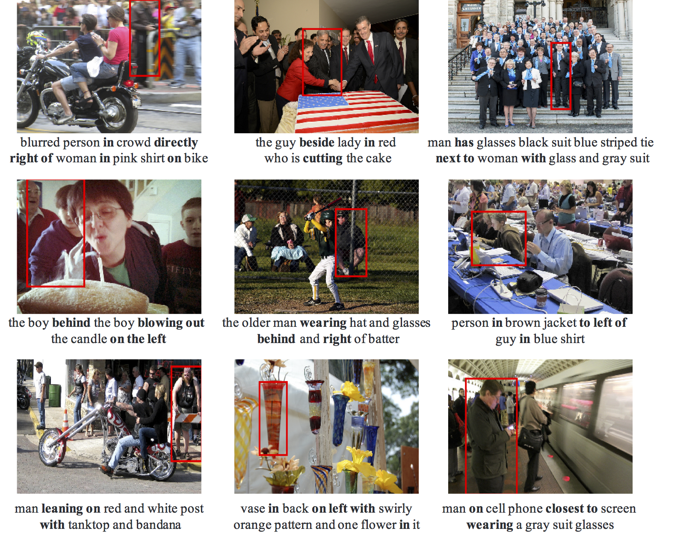

# Complex Relationship Reasoning Evaluation for Referring Expression Grounding

## Introduction

This repository provide a validation set to evaluate the complex relationship reasoning for Referring Expression Grounding (REG) task. These data mainly contain the referring expressions with higher-order or multi-entitiy relationship, which is selected from the original RefCOCO, RefCOCO+ and RefCOCOg validation and test set. 
<!-- 先介绍REG，复杂场景下，难点在于关系挖掘，高阶关系更是难点更能体现REG的推理能力 -->
Relationship reasoning is one of the main challenge in REG, as REG needs to distinguish the target from other objects, usually the same category. 
<!-- 我们选择了一个多大的验证集来评估reg能力，一些例子在下面 -->

## Prerequisites

* Python 3.5
* Pytorch 0.4.1
* CUDA 8.0

## Data Prepare

   Please refer to [MattNet](https://github.com/lichengunc/MAttNet) to install [mask-faster-rcnn](https://github.com/lichengunc/mask-faster-rcnn), [REFER](https://github.com/lichengunc/refer) and [refer-parser2](https://github.com/lichengunc/refer-parser2).
   Follow Step 1 & 2 in Training to prepare the data and features.

## Performance on complex relationship
1) Examples 复杂referring
   

1) Performance
   多写一点 介绍num和占比，不同数据集的特点在refcocog上更复杂更挑战
<table>
<tr><td>

|  | RefCOCO | RefCOCO+ | RefCOCOg|
|:--:|:--:|:--:|:--:|
| num   |  653 （12\%）   | 637 (\%)    |  4233 (\%)   |
|--|--|--|--|
| mcxtp | 17.46\% | 20.88\% | 43.11\% |
| scxtp | 21.75\% | 21.66\% | 46.47\% |

</td></tr> 
</table>

