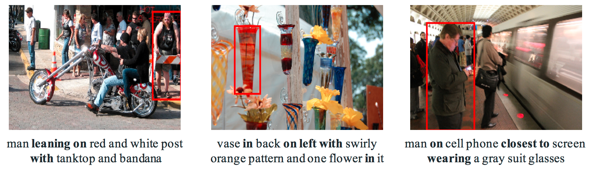

# This is the PyTorch Implementation of EARN

## Introduction
This repository is Pytorch implementation of Entity-enhanced Adaptive Reconstruction Network for Weakly Supervised Referring Expression Grounding.

## Prerequisites

* Python 3.5
* Pytorch 0.4.1
* CUDA 8.0

## Installation

1. Please refer to [MattNet](https://github.com/lichengunc/MAttNet) to install [mask-faster-rcnn](https://github.com/lichengunc/mask-faster-rcnn), [REFER](https://github.com/lichengunc/refer) and [refer-parser2](https://github.com/lichengunc/refer-parser2).
Follow Step 1 & 2 in Training to prepare the data and features.

2. Calculate semantic similarity as supervision infotmation.

* Download [Glove](https://drive.google.com/file/d/1SuKn09iiYlGo0evZIJHkmpXOhLNc5f_s/view?usp=drive_web) word embedding to cache/word_embedding.

* Generate semantic similarity and word embedding file.
```bash
python tools/prepro_sub_obj_wds.py --dataset ${DATASET} --splitBy ${SPLITBY}
python tools/prepro_sim.py --dataset ${DATASET} --splitBy ${SPLITBY}
```


## Training

Train EARN with ground-truth annotation:

```bash
sh train.sh
```

## Evaluation

Evaluate ARN with ground-truth annotation:

```bash
sh eval.sh
```


## Evaluation for Complex Relational Reasoning of Referring Expression Grounding
We gather the referring expressions with higher-order or multi-entity relationships (mainly based on the length of the referring expression and the number of entities) from the original RefCOCO, RefCOCO+ and RefCOCOg validation and test set to evaluate the ability of models to reason the complex relationship. You can download the validation set in [cache/prepro/](cache/prepro/). 

1) Examples.
   
   There are some examples for referring expressions with higher-order or multi-entity relationships. More examples can be seen in [visualization.ipynb](visualization.ipynb). 
   
 
 
 
<!-- <center>Some examples of the validation set with complex relationship.</center> -->


2) Our performance.
   
   Here we show the number (num) and its percentage (ratio) of the expressions with complex relationships in original validation and test set, and the accuracy (IoU > 0.5) comparison of the max-context pooling (mcxtp) and soft-context pooling (scxtp). The RefCOCOg dataset has longer queries, so the cases with complex relationships are much higher. From the results, we can see soft-context pooling can perform better on complex relational reasoning.
<center>
<table>
<tr><td>

|  | RefCOCO | RefCOCO+ | RefCOCOg|
|:--:|:--:|:--:|:--:|
| num   |  653    | 637     |  4233   |
| ratio | ~3\%    | ~3\%    |  ~44\%  |
| mcxtp | 17.46\% | 20.88\% | 43.11\% |
| scxtp | 21.75\% | 21.66\% | 46.47\% |

<!-- | num   |  653 （~3\%）   | 637 (~3\%)    |  4233 (~44\%)   |
| num   |  653 （~3\%）   | 637 (~3\%)    |  4233 (~44\%)   | -->
</td></tr> 
</table>
</center>
